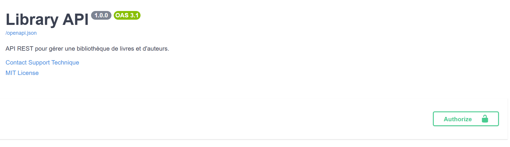
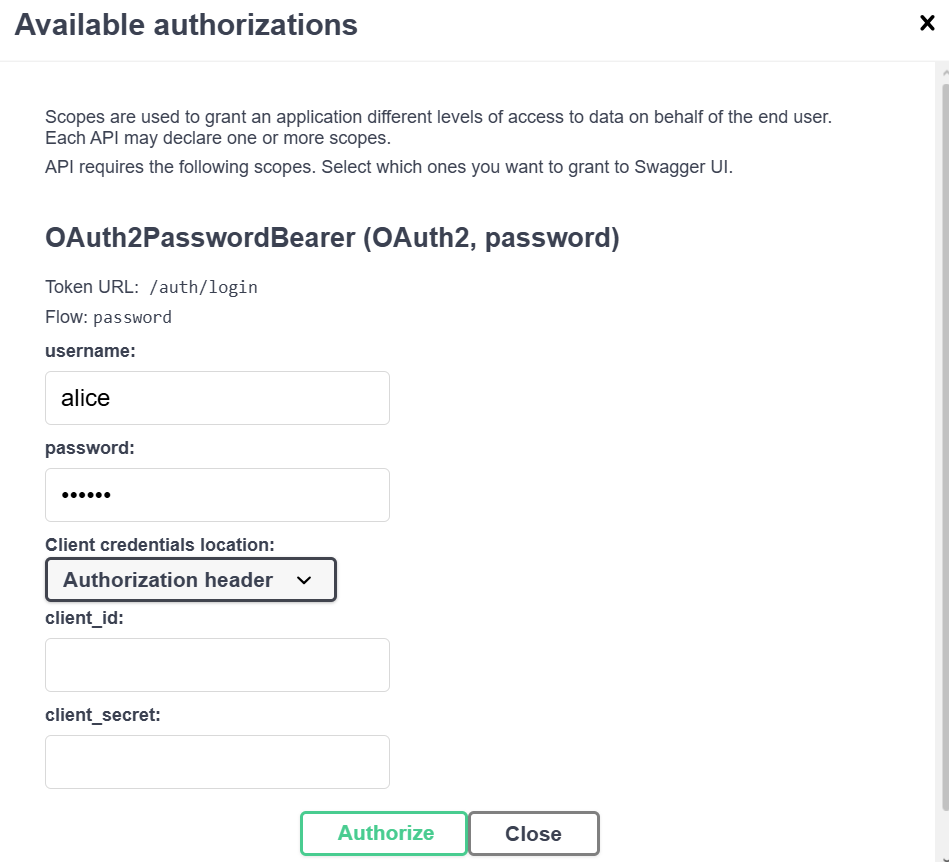
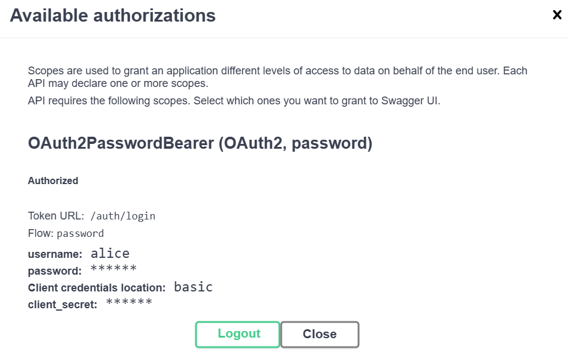
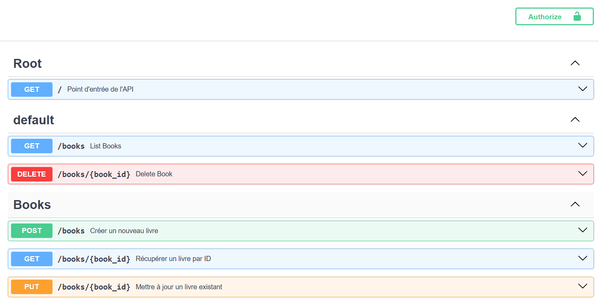
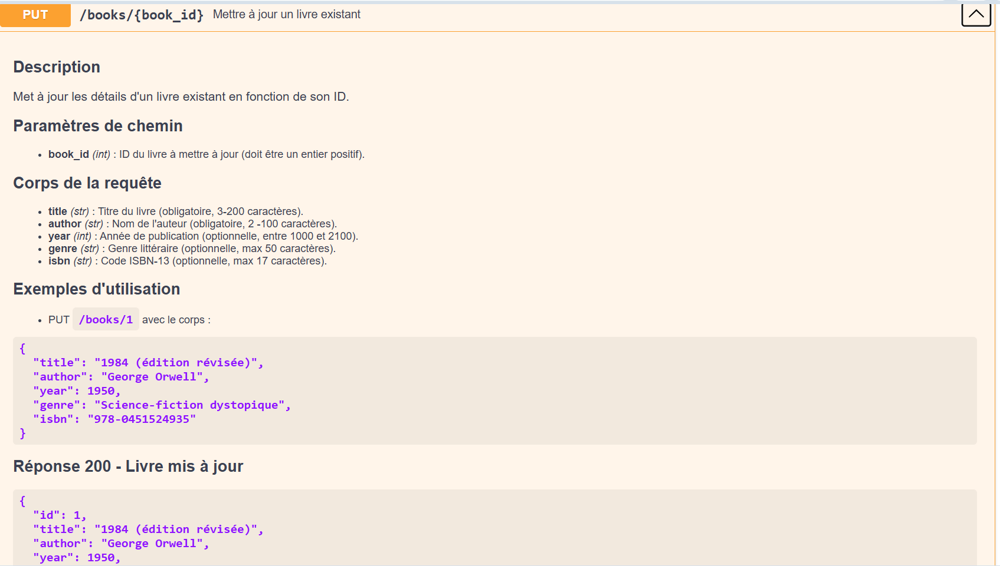
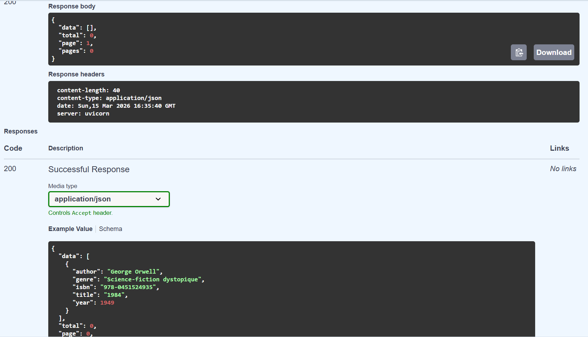
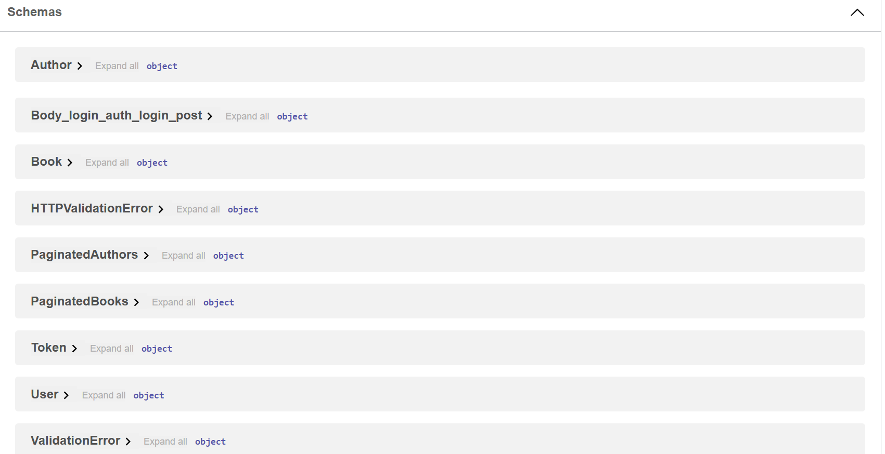
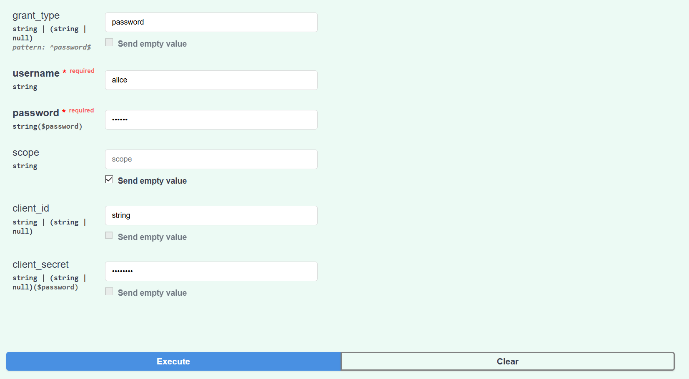
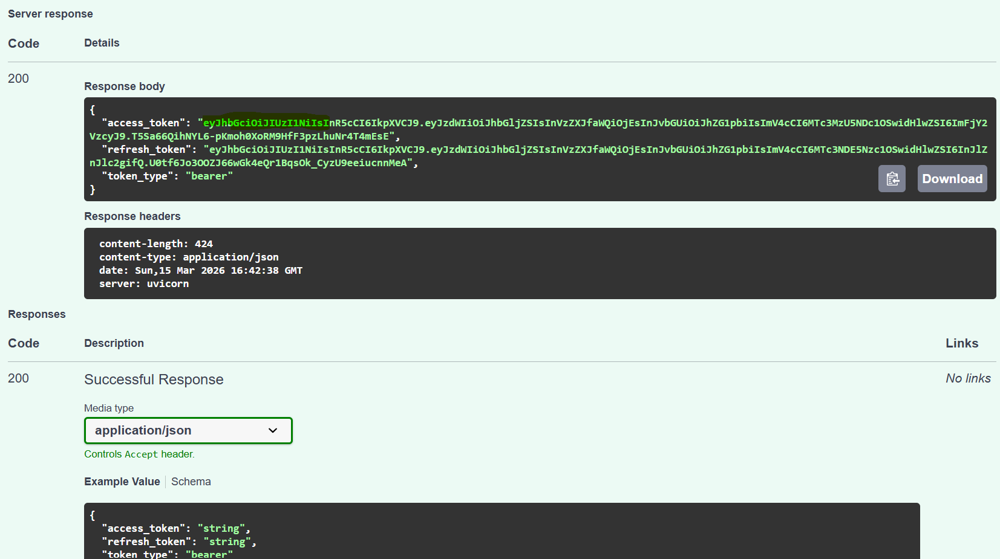
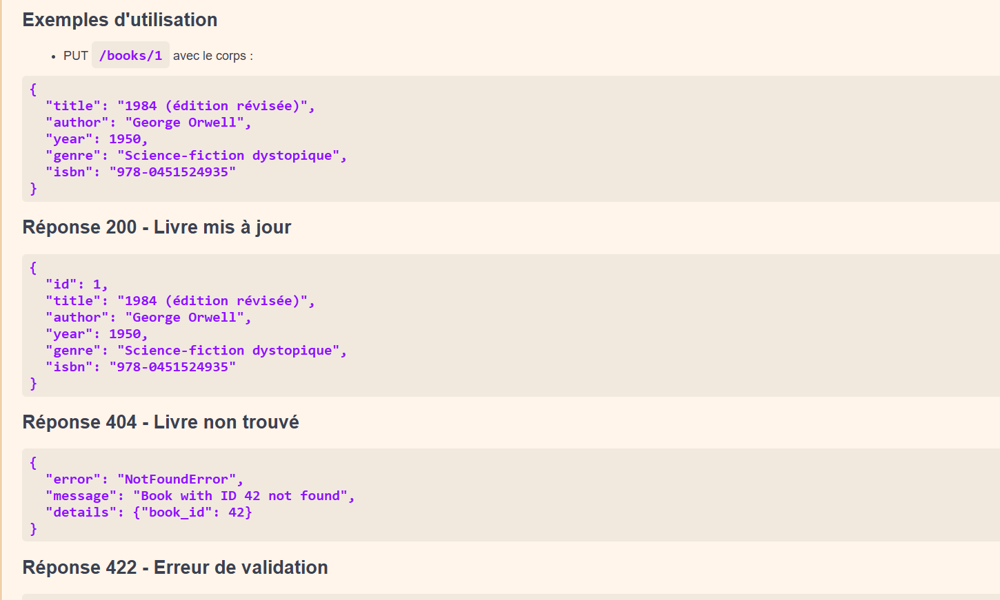

# 📚 Library API – FastAPI

API backend développée avec **FastAPI** permettant de gérer une bibliothèque.  
Elle inclut un CRUD complet, une validation avancée avec Pydantic v2 et une documentation automatique via Swagger.

---

## 🚀 Fonctionnalités

- Documentation automatique via **Swagger UI** (`/docs`)


- se connecter 

-possibilité de se déconnecter ou non


- CRUD complet (Create, Read, Update, Delete)


- Validation des données avec **Pydantic v2**



- Tests unitaires avec **pytest**
- Architecture modulaire (routers, services, schemas)

- Authentification JWT 

- Connexion reussie


---

## 🛠️ Installation & lancement

### 1. Cloner le projet

```bash
git clone https://github.com/jenet2024/python-projet.git
cd python-projet


Descriptions des paramètres (Query, Path)
Exemples de réponses (succès et erreurs)

Tags pour organiser les endpoints
Créer un modèle ErrorResponse pour standardiser les erreurs
Ajouter des exemples dans les modèles Pydantic (Config.json_schema_extra)


## Authentification JWT
Ajouter l'authentification JWT à votre API Library 

Fonctionnalités à implémenter
Route de login : POST /auth/login (username + password → JWT)
Protéger les routes :
GET /books : Authentification requise
POST /books : Authentification requise
PUT /books/{id} : Authentification requise
DELETE /books/{id} : Admin uniquement
Route me : GET /auth/me (récupère infos user connecté)
Gestion des rôles : user / admin


## Gestion du cache sur toutes les méthodes que j'ai faite 

gestion du cahe sur toutes les methodes que j'ai faite 
